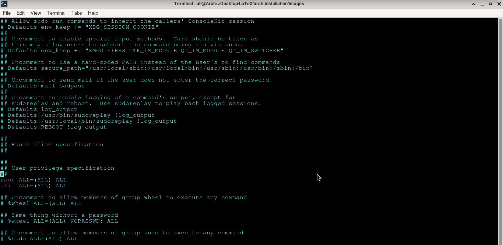

# Arch Linux Installation Tutorial
<p align="center">
  
  
  
<br><br>
<a href="https://github.com/alikzmi/archinstall-tutorial/releases/">

Downlod PDF</a> Or Read here
<br>

## Arch Linux Installation Guide for BIOS

### Downlod The ISO Image
You can <a href="https://archlinux.org/download/"> download </a> Arch Linux from its official website.

### Verify signature
Install GnuPG on your Linux distribution and <a href="https://wiki.archlinux.org/title/Installation_guide#Verify_signature"> verify </a> the iso signature.

### prepare an installation medium
First of all plug in your usb flash drive to your device usb port.
```
$ lsblk -f
```
With this command you can find your usb flash drive name.


Now you can make a bootable usb flash drive with ‍`dd` utility.
```
# dd bs=4M status=progress if=arch.iso of=/dev/sdc oflag=sync
```
1. Enter the iso image path instead of `arch.iso`
2. Enter your usb flash drive name instead of `/dev/sdc`

### Connect to the internet
I recommend you to use Ethernet instead of Wifi.

### Partition the disks
I want to make a swap file instead of swap partition. So i make one partiton.
Enter this command :
```
# cfdisk /dev/sda
```
1.  Make one partition and select `Linux (83)` as its type
2. Set the `bootable flag` for this partition
3. Write partition table to disk and select ”Quit”

### Format the partitions
I prefer the Btrfs format :
```
# mkfs.btrfs /dev/sda1
```
### Mount the file system
Mount your [root] partition to `/mnt` :
```
# mount /dev/sda1 /mnt
```
### Install essential packages
Use pacstrap to install essential packages.
```
# pacstrap /mnt base linux linux-firmware man-db man-pages vim
```
### Fstab
Generate an <a href="https://wiki.archlinux.org/title/Fstab"> fstab </a> file with `gen-fstab` command :
```
# genfstab -U /mnt >> /mnt/etc/fstab
```
### Chroot
Change root into the new system :
```
# arch-chroot /mnt
```
### Localization
For this part folow this instruction :
```
# vim /etc/locale.gen
```
Uncomment the `en US.UTF-8 UTF-8`
Uncomment other locales , if needed
```
# locale-gen
# vim /etc/locale.conf
```
Add `LANG=en US.UTF-8` and save changes

### Network configuration
Folow this instruction :

1. `# vim /etc/hostname`
2. Enter your `hostname` and save the changes
3. Add matching entries to `/etc/hosts` :

```
127.0.0.1 localhost
::1 localhost
127.0.1.1 myhostname.localdomain myhostname

```
4. Replace `myhostname` with your hostname
5. Replace `localdomain` with your localdomain
6. Install and start network manager :

```
# pacman -S networkmanager |
# systemctl enable NetworkManager
```
7. Now you can use `nmcli` & `nmtui` utilities to connect to the internet

### Root password
Set the root password with this command :
```
passwd
```
Now enter the `New password`. And again !

###  Boot loader
Choose and install a Linux-capable boot loader and install microcode.
1. `# pacman -S grub (boot loader)`
2. Install microcode :

```
# pacman -S intel-ucode (for intel processors)
# pacman -S amd-ucode (for amd processors)
```
3. Install `os-prober` & `ntfs-3g` :

```
# pacman -S os-prober ntfs-3g
# grub-install −−target=i386-pc /dev/sda
# grub-mkconfig -o /boot/grub/grub.cfg
```

### Reboot
Exit the chroot environment by typing `exit` or pressing `Ctrl+d`.
Finally, restart the machine by typing `reboot`.

### Set time zone
Follow this instruction :
1. `# timedatectl set-ntp true`

```
# ln -sf /usr/share/zoneinfo/Region/City /etc/localtime
```
2. Replace `/Region/City` with your region and city. this one is for Iran

```
# ln -sf /usr/share/zoneinfo/Asia/Tehran /etc/localtime
```
3. `# hwclock −−systohc`

### Select the mirror
You can find the fastest mirror by this command :
```
# pacman -S reflector
# reflector −−country Germany −−age 12 −−protocol https −−sort rate −−save /etc/pacman.d/mirrorlist
# pacman -Syy
```
You can replace `Germany` with other countries.
###  Install Desktop Environment
I show you how to install xfce4 with lightdm :
1. Install graphics card driver :

```
# pacman -S xf86-video-amdgpu xf86-video-ati
```
2. For other graphics cards search `xf86-video` and find the driver name

```
# pacman -Ss xf86-video
# pacman -S xf86-video-nouveau (for Nvidia graphic cards)
```
3. Install lightdm & xfce4

```
# pacman -S xorg-server
# pacman -S lightdm lightdm-gtk-greeter lightdm-gtk-greeter-settings
# systemctl enable lightdm
# pacman -S xfce4
# reboot
```
###  Post-installation
For this part you can read my another guide about Arch Linux :

#### `Things to do After Installing Arch`

1. Login as root and create a user and add it to the `wheel` group :

```
# pacman -S sudo
# useradd -mG wheel [user name]
# vim /etc/sudoers
```
Edit the sudoers file like this :



replace `ali` with your `user name`
2. Now you can use `sudo` for your commands
3. you can make swapfile (4G) by this instruction :

```
# mkdir /swap
# chattr +C /swap (for Btrfs)
# cd /swap
# dd if=/dev/zero of=/swap/swapfile bs=1024 count=4M
# chmod 600 /swap/swapfile
# mkswap /swap/swapfile
# swapon /swap/swapfile
```
4. you can set any size for swapfile (size = bs×count)
5. edit fstab file :

```
# vim /etc/fstab
```
Add these lines to the fstab file :


Save changes !

```
# reboot
```

<br>
Arch Wiki provides a general recommendations for this purpose.

### END !
